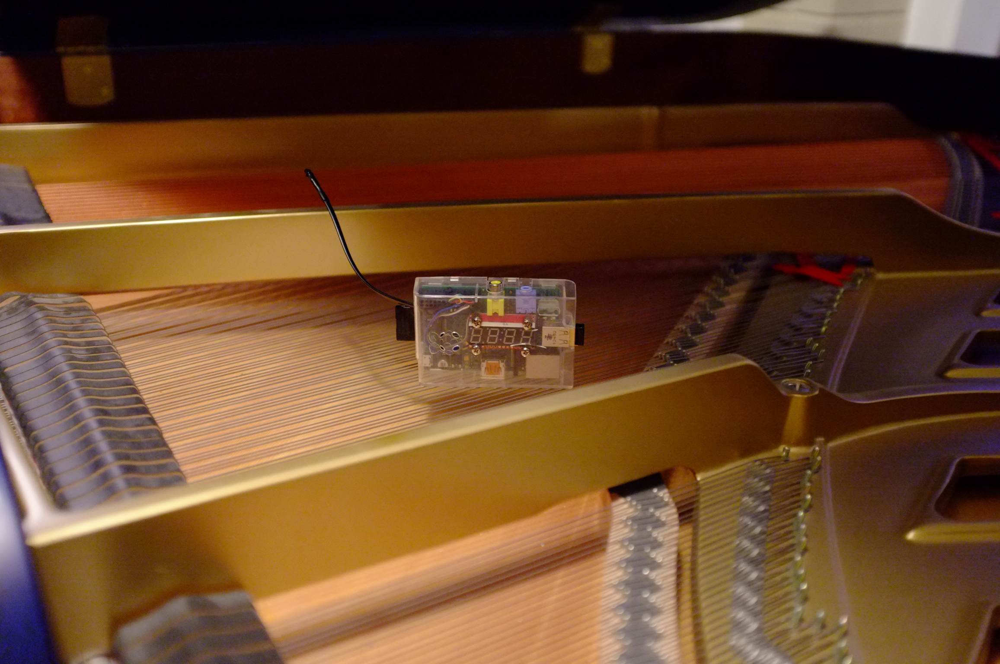

# Temperature Monitoring and Alert System for Pianos at Lutkin Hall

<!-- *Update: Although this system was fully implemented and tested for several weeks it was never actually installed at Lutkin due to the vagaries of university bureaucracy* -->

## Problem Statement
[Lutkin Hall’s](http://www.northwestern.edu/norris/events/satellite-venues/lutkin-hall/) HVAC system requires frequent manual adjustment from Northwestern University's facilities department to function properly.  Currently students or faculty who happen to be in the building notice an issue and alert the maintenance personnel by making a phone call.  This does not happen consistently and as a result the temperature at Lutkin Hall varies, often by a large amount, which causes the grand pianos housed there to go out of tune.  This in turn leads to frequent re-tuning and likely negatively affects the long term health of these expensive instruments.

## Proposed Solution

We propose to install a small and inexpensive wireless thermometer system that will measure and record the ambient temperature in the piano room and place a phone call to the facilities maintenance personnel when the temperature reaches predefined limits.

The system will have configurable temperature limits, allowed times for calls (for example M-F, 8am-5pm), and the phone call repetition rate (for example every 4 hours until temperature is back in range).  Graphs of current and historical temperature data will be available for viewing through a web page to serve as a tool for the maintenance department in managing and troubleshooting the heating system at Lutkin Hall.

Here is an example phone message:
“Hello, I’m calling from Lutkin Hall located at 700 University Place.  The temperature in the piano room is currently 62 degrees and has been below 72 degrees for 8 hours.  Low temperature may damage sensitive musical instruments located here.  Please attend to this urgent matter as soon as possible”.

This device will require a small amount of power (a few Watts, similar to a phone charger) and access to Northwestern's wireless network in order to make phone calls using the internet.  The bandwidth requirement for the internet connection is negligible.

## Technical Details
The monitor consists of a Raspberry Pi computer, a DS18B20 I2C thermometer, a serial seven segment display, and a wifi dongle. Phone calls and SMS messages are placed using [Twilio](https://www.twilio.com/docs/libraries/python). Historical data is logged to a google sheets document. The code is written in python.

